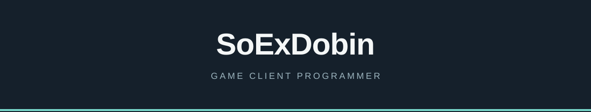

### 최재욱 · Game Client Programmer

C++ / DirectX 기반 게임 클라이언트를 만듭니다. 캐릭터 동작, 전투, 엔진·에디터 작업을 해왔습니다.

    

## Projects

- **Clair Obscur: Expedition 33 모작** · 8인 팀 / DirectX 11  
  모델·애니메이션 변환, 캐릭터 상태와 Root Motion, 전투 화면 효과, 맵 데이터 연동
- **NieR:Automata 모작** · 개인 / DirectX 11  
  자체 엔진·에디터, 애니메이션 이벤트, 플레이어 전투, Recast 내비게이션
- **Moonlighter 모작** · 5인 팀 / DirectX 9  
  게임 오브젝트·충돌 구조, 씬 전환, 사막 던전 보스와 몬스터

## Public code

[StudyMetalSlug3](https://github.com/SoExDobin/StudyMetalSlug3/tree/feat/day1-player-and-setup) · [WinAPI](https://github.com/SoExDobin/WinAPI) · [SlimeDicer](https://github.com/SoExDobin/SlimeDicer)

한세대학교 컴퓨터공학과 졸업 · 쥬신게임아카데미 게임 클라이언트 심화 과정 수료. 위 모작 프로젝트는 학습 목적으로 제작했습니다.
